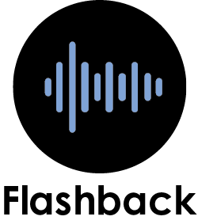

## Roku FlashBack App.

This is CMS streaming project

## Getting Started
Download the file and run the index.html on an http server. See Deployment and Installing for more details.

## Installing
*Terminal: cd Desktop (If on a Max use /Desktop instead) git clone https://github.com/sebastiandesign/Flashback

*Terminal: Click on the Download button on the github repository and unzip it on your directory of choice.

## Deployment
You can use Visual Studio Code to launch the Files on a Web server or use your terminal as a local simple HTTP server. To visualize the database, you can run on your terminal the command "npm start" inside the downloaded/cloned directory.

## Built With
Visual Studio Code - The code editor used.
Versioning
1.0

Authors
Jonathan Teves - Design - jtev23
Walter Carrera - Developer - Sebastiandesign
Acknowledgments
Fanshawe College